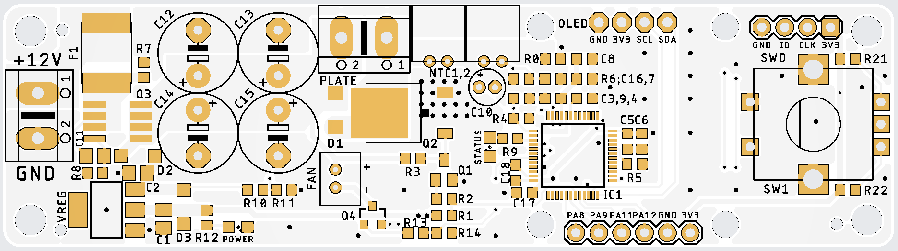
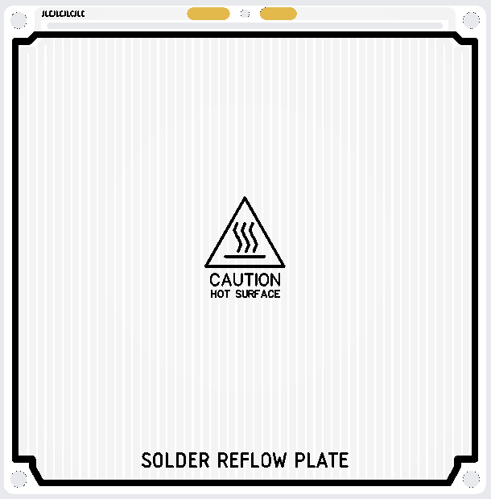

## About

This project contains required PCB design files. This board is mainly designed around the [original](https://github.com/Berkays/ReflowPlate/) design.

I modified the plate to max out heating area and the 10x10 cm dimension. The trace length (without the wider connection in the beginning) is 5023 mm, the calculated resistance is 1.787 Ohms. You can order this from JLCPCB in aluminium for a very cheap price.

I modified the controller PCB to be the same width as the plate, so you can mount the controller on top of the plate with spacers. Also the display and the rotary encoder is mounted directly to the PCB.

Everything in the schematics is (should be) the same as in the original project, except a few things:
- I needed to modify the voltage divider (R10, R11), because the original values are not available as basic parts at JLCPCB. It almost the same, even if you use the orginal firmware.
- I added two more capacitors (C17, C18) for the third side of the STM32
- I added a header with some GPIOs, because there was some spare space on the PCB for it.

Most of the parts are a basic part at JLCPCB (or preferred extended part, which does not have a load in fee), so it's pretty cheap to get this board assembled. Only F1, Q2 and Q3 needs to be soldered by hand (if you want to save on the load in fee on those two parts). And also the 5 THT capacitors (C12-15 and C10).

Controller PCB:

Plate PCB:

### Features

- Two NTC Support
- Rotary encoder input
- I2C Display
- Fan output

## License

This project is licensed under the MIT License - see the [LICENSE](LICENSE) file for details.
